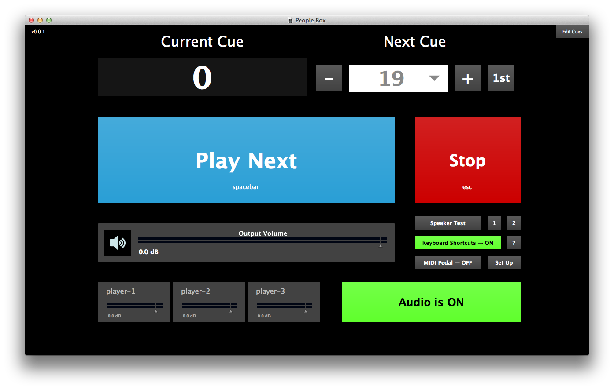

# people-box 

:violin: Sample playback for Clara Iannotta’s [_The people here go mad. They blame the wind._](http://claraiannotta.com/works/chamber-music/the-people-here-go-mad-they-blame-the-wind/)

## Installation

`people-box` is a package for use with Cycling 74’s [Max](https://cycling74.com/products/max/) software. If you don’t own Max, you can [download it from Cycling 74’s website](https://cycling74.com/downloads/) for free.

To install the `people-box` package:

1. Download the [__latest version__](https://github.com/delucis/people-box/releases/latest) (click on `people-box.zip`).

2. Unzip it to your packages directory:    
`~/Documents/Max/Packages` for Max 6 or `~/Documents/Max 7/Packages` for Max 7.

## Performance Set-up

A performance of _The people here go mad. They blame the wind._ requires the following technical set-up:

- a computer running the `people-box` Max package
- a stereo pair of loudspeakers in front of or either side of the quartet for sound output
- (optionally) a MIDI pedal and interface for cue triggering

## Operating the People Box

### Getting Started

1. Open **Max**.

2. Select **People Box** from the **Extras** menu. This window should appear:

  

3. Turn on the audio, using the large red button that reads **Audio is OFF**. It will turn green and read **Audio is ON**.

4. If you need to test your audio output, you can use the **Speaker Test** button to send out short bursts of white noise. To test just one channel at a time, you can use the buttons marked **1** and **2**.

### Performing with the People Box

The People Box window indicates the **Current Cue** at the top left, and the **Next Cue** that will be played at the top right. Cues are numbered to match the bar numbers in which they occur, so the first cue number is 32.

During a performance, use the large blue **Play Next** button or the <kbd>spacebar</kbd> to trigger the next cue at the appropriate moment.

By default, keyboard shortcuts are enabled and you can use the following shortcuts to control the People Box:

|      shortcut       |                                  |
|:-------------------:|:---------------------------------|
| <kbd>spacebar</kbd> | _play next cue_                  |
|  <kbd>escape</kbd>  | _stop playing_                   |
|    <kbd>1</kbd>     | _set next cue to be first cue_   |
|    <kbd>▶</kbd>     | _increment next cue number_      |
|    <kbd>◀</kbd>     | _decrement next cue number_      |
|    <kbd>▲</kbd>     | _increase output volume by 1 dB_ |
|    <kbd>▼</kbd>     | _decrease output volume by 1 dB_ |

### Rehearsal Tips

- To stop playback at any point during rehearsal, click the red **Stop** button, or hit the <kbd>escape</kbd> key.

- Use the <kbd>◀</kbd> and <kbd>▶</kbd> arrow keys to set up the next cue, or use the <kbd>1</kbd> key to reset the next cue to the beginning. To select a specific cue, you can click on the **Next Cue** number and a menu will appear from which you can choose the cue you need.

### Using a MIDI pedal

If you prefer not to use the keyboard to trigger cues during a performance,
you can use a MIDI pedal instead. Pressing the pedal will trigger the next event
and is equivalent to using the <kbd>spacebar</kbd> or pressing the **Play Next**
button.

#### Configuring your pedal

1. Click on **Set Up** to open the MIDI pedal configuration window.

2. Select the correct MIDI device for your pedal.

3. Select whether the next event should be triggered on `127` or `0`.

In the lower half of the **Set Up** window, you will be able to see the pedal
input as it comes in to help while configuring your MIDI pedal.

## Editing cues

For more information about how to edit and add/remove cues, see [`CUES.md`](CUES.md).
